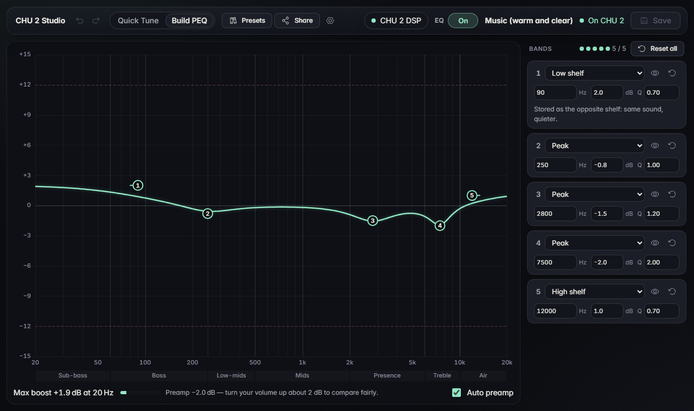
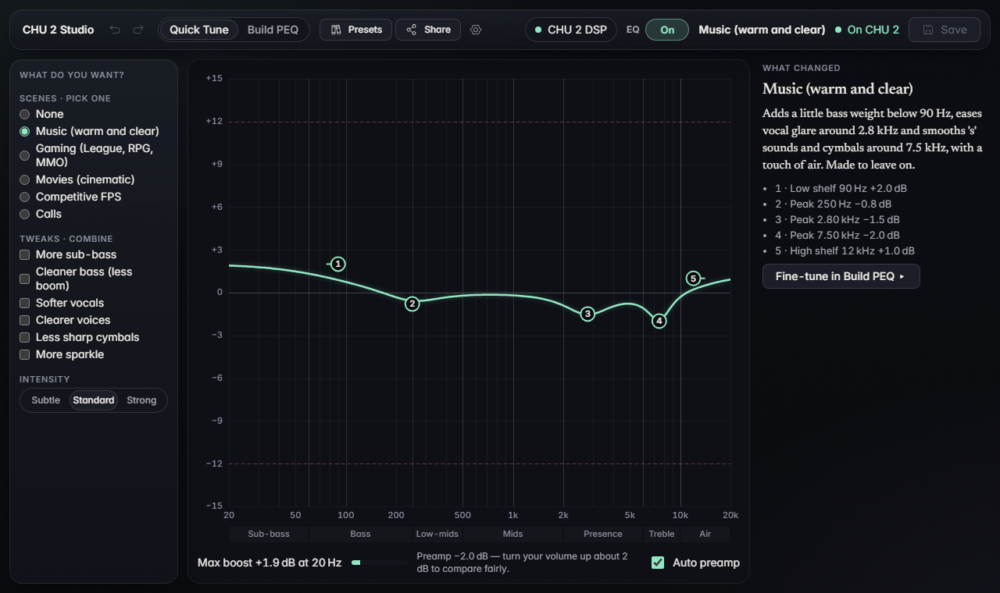
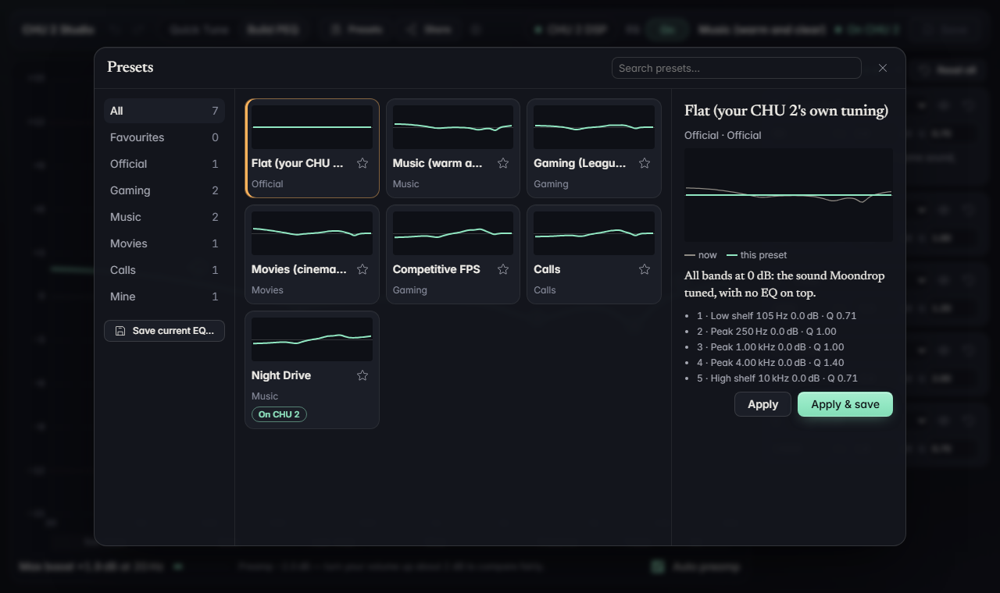
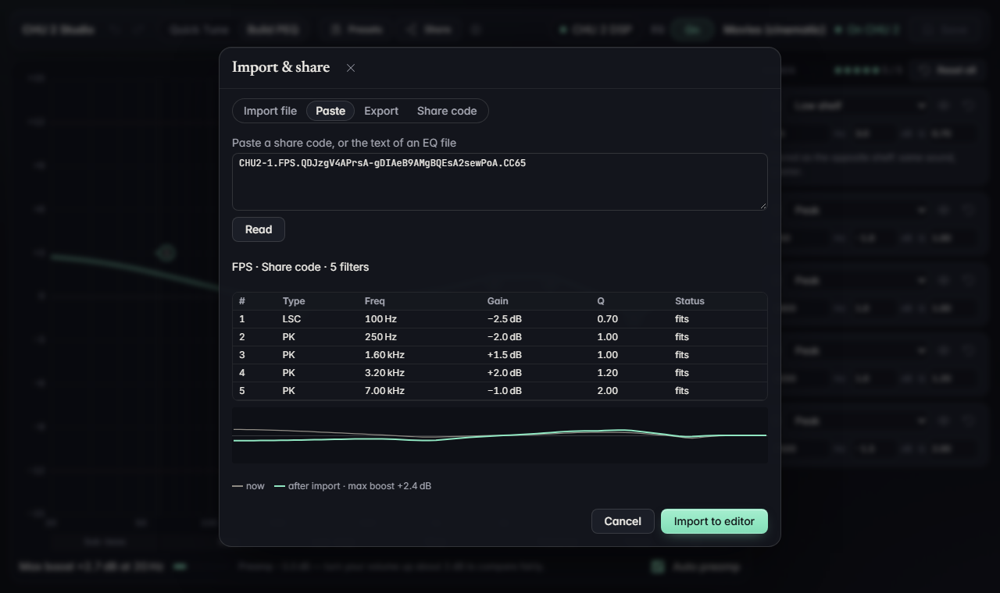

<p align="center">
  
</p>

<p align="center">
  <a href="https://github.com/jcharvet/chu2-studio/actions/workflows/build.yml"></a>
  <a href="https://github.com/jcharvet/chu2-studio/releases/latest"></a>
</p>

# CHU 2 Studio

Tune the EQ **inside** your Moondrop CHU 2 DSP earphones, from Windows, for free.

The CHU 2 DSP has a small equaliser built into its USB-C cable. Moondrop's own
Hub app does not support this model, so there was no way to change that EQ.
CHU 2 Studio does it: you pick a sound, press Save, and the earphones keep it —
on your phone, on a console, on any PC, with no app running.

Not affiliated with, or endorsed by, Moondrop. MIT licence.



---

## Install

1. Download `CHU2Studio-0.1.1-win64.zip` from the
   [latest release](../../releases/latest).
2. Unzip it anywhere, for example `Documents\CHU2Studio`.
3. Run `CHU2Studio.exe`.

No installer, no admin rights, no driver. Windows 10 or 11, 64-bit.

The app is not signed yet, so Windows may show "Windows protected your PC".
Choose **More info → Run anyway**. The `.exe` is built from this repository with
`python packaging/build_exe.py`, so you can also build your own.

To uninstall, delete the folder. Your presets and settings live in
`%APPDATA%\CHU2Studio` (Settings → Open data folder), so delete that too if you
do not want to keep them.

## What it does

- **Quick Tune** — five ready sounds (Music, Gaming, Movies, Competitive FPS,
  Calls), each with a strength control and plain-language tweaks such as
  "Cleaner bass" or "Less sharp cymbals".
- **Build PEQ** — the five bands the chip has, on a graph you can drag, with
  numbers you can type. Undo and redo included. The chip gives you the full
  range: 20 Hz to 20 kHz in 1 Hz steps, ±12 dB in 0.1 dB steps, Q from 0.1 to 10
  — finer control than Moondrop's own FreeDSP cable offers.
- **Hear before you save** — every change plays at once. Nothing is written to
  the earphones until you press Save.
- **Import and share** — read AutoEq, Equalizer APO and Peace files (it keeps
  the five biggest filters), export the same, or copy a short share code.
- **Presets** — a library with your own saved EQs and favourites.
- **Safe by design** — the first time it connects, it saves your earphones'
  original EQ on your PC. "Restore original" puts it back at any time.

**Quick Tune** — pick a sound, add tweaks in plain words, choose how strong:



**Presets** — your own EQs and the ready ones, with a badge on the one your
earphones have:



**Import and share** — paste a share code or an AutoEq file and see what the
five bands will be, before anything changes:



## Good to know

- **Saving restarts the earphones** for about a second, and the sound stops
  during that. This is the chip, not a bug.
- **The chip has no volume control of its own.** A boost can distort, so the app
  quietly lowers the whole EQ by the size of the biggest boost. That makes the
  sound quieter; turn your volume up when you compare.
- **Unsaved changes are lost when you unplug.** The saved EQ comes back.
- **It changes what you hear, not your microphone.**

## For developers

```bash
python -m venv .venv
.venv\Scripts\python -m pip install -e ".[dev]"
.venv\Scripts\python -m playwright install chromium   # for the UI tests

.venv\Scripts\python -m pytest -q tests               # 262 tests
.venv\Scripts\chu2-studio --fake-device               # run without hardware
.venv\Scripts\python -m pip install -e ".[build]"
.venv\Scripts\python packaging/build_exe.py           # the .exe and the zip
```

The app is Python with a [pywebview](https://pywebview.flowrl.com/) window and a
Vue page (vendored, no Node). `src/chu2/` holds the device code; `src/chu2/app/`
holds the window, and `src/chu2/app/ui/` the page.

The USB side needs no driver: the CHU 2's control channel is a HID device that
Windows shares, so [hidapi](https://github.com/libusb/hidapi) reaches it. The
commands are written down in [`docs/PROTOCOL.md`](docs/PROTOCOL.md), and
[`docs/API.md`](docs/API.md) describes the Python modules.

There is also a command line for the EQ in the device:

```bash
chu2 dsp read          # show the EQ the CHU 2 has stored
chu2 dsp write my.json # write it, check it, save it
chu2 dsp restore       # back to the EQ found before the first write
```

Issues and pull requests are welcome. Tests come first: every change here ships
with one.

## Thanks

- [devicePEQ](https://github.com/jeromeof/devicePEQ) — the KTMicro command
  format that made this possible.
- [Catppuccin](https://github.com/catppuccin) (themes),
  [Phosphor Icons](https://phosphoricons.com/), Inter, Newsreader and
  JetBrains Mono (fonts), [Vue](https://vuejs.org/) — each under its own licence,
  listed in the app under Settings → About.
- Moondrop, for the CHU 2 and its DSP.
